[//]: # (To view this file use: python -m pip install grip; python -m grip -b "Jadlog - OpenCart.md")
[//]: # (https://github.com/settings/tokens)
[//]: # (vim ~/.grip/settings.py)
[//]: # (PASSWORD = 'YOUR-ACCESS-TOKEN')
[//]: # (https://github.com/naokazuterada/MarkdownTOC)
[//]: # (Many thanks to silentcast for animated gif generation: ppa:sethj/silentcast)

# Extensão de Frete Jadlog - OpenCart 2.0.3.1


## Conteúdo
<!-- MarkdownTOC -->

- [Introdução](#introdu%C3%A7%C3%A3o)
  - [Compatibilidade](#compatibilidade)
  - [Arquivos e documentos necessários](#arquivos-e-documentos-necess%C3%A1rios)
  - [Avisos importantes](#avisos-importantes)
    - [Nota sobre localização](#nota-sobre-localiza%C3%A7%C3%A3o)
- [Instalação](#instala%C3%A7%C3%A3o)
- [Configuração](#configura%C3%A7%C3%A3o)
  - [Acesso](#acesso)
  - [Parâmetros iniciais](#par%C3%A2metros-iniciais)
  - [Configurar produtos](#configurar-produtos)
- [Utilização pelos clientes](#utiliza%C3%A7%C3%A3o-pelos-clientes)
- [Utilização pelo administrador da loja](#utiliza%C3%A7%C3%A3o-pelo-administrador-da-loja)
  - [Preencher dados fiscais](#preencher-dados-fiscais)
  - [Enviar solicitação de coleta](#enviar-solicita%C3%A7%C3%A3o-de-coleta)
- [Desenvolvimento](#desenvolvimento)

<!-- /MarkdownTOC -->


<a id="introdu%C3%A7%C3%A3o"></a>
## Introdução

Este documento auxilia a instalação, configuração e utilização da extensão OpenCart na integração do serviço de frete Jadlog em sua plataforma e-commerce OpenCart.

<a id="compatibilidade"></a>
### Compatibilidade

- OpenCart versão 2.0.3.1
- **PHP 5.6** disponível em seu servidor para integração da extensão ao webservice.
- Extensão vQmod instalada (https://github.com/vqmod/vqmod). A versão utilizada para homologação: 2.6.3.

<a id="arquivos-e-documentos-necess%C3%A1rios"></a>
### Arquivos e documentos necessários
Após o aceite da Proposta Comercial, serão fornecidos:
- Contrato Jadlog
- Documento técnico de acessos para configurações
- [Arquivo zip com a extensão Jadlog - OpenCart](../package/jadlog.ocmod.zip)
- Este manual de instalação e utilização

<a id="avisos-importantes"></a>
### Avisos importantes
* Deve-se testar a extensão em um ambiente de homologação antes de colocá-lo em produção.
* Faça backup do sistema regularmente - especialmente antes de instalar uma nova extensão.

***A Jadlog não se responsabiliza por eventuais perdas de dados.***

<a id="nota-sobre-localiza%C3%A7%C3%A3o"></a>
#### Nota sobre localização
Recomendamos o uso do software OpenCart adaptado às peculiaridades do Brasil para a utilização correta desta extensão. Essa adaptação envolve certos procedimentos de configuração que não fazem parte do escopo deste documento.  
<sub>* *Sobre esse assunto há amplo material disponível para consulta na internet*.</sub>

<a id="instala%C3%A7%C3%A3o"></a>
## Instalação
**Antes de instalar a extensão *jadlog.ocmod* faça a instalação do [vQmod 2.6.3](https://github.com/vqmod/vqmod/releases/download/v2.6.3-opencart/vqmod-2.6.3-opencart.zip).**  
<sup>Instruções: https://github.com/vqmod/vqmod/wiki/Installing-vQmod-on-OpenCart.</sup>  
Certifique-se que o software OpenCart está instalado em local seguro em seu computador/servidor. O modo de instalação é manual e deve-se descompactar o arquivo *zip* disponibilizado pela Jadlog diretamente na pasta raiz do software OpenCart.

```
Durante a extração dos arquivos o sistema pode acusar que alguma pasta já existe.
Nesses casos deve-se aceitar que elas sejam sobreescritas.
```

<a id="configura%C3%A7%C3%A3o"></a>
## Configuração
Após a cópia dos arquivos é necessário configurar o acesso à extensão e depois configurar os parâmetros iniciais.

<a id="acesso"></a>
### Acesso
Para liberar acesso às páginas da extensão é necessário acessar o menu *Configurações -> Grupos de Usuários*:

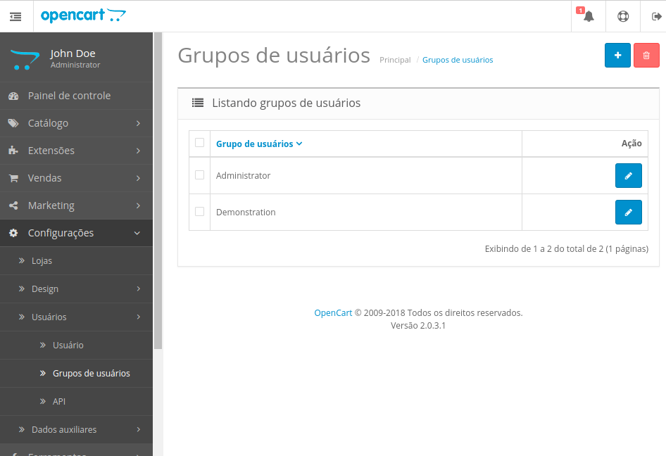

Acesse a tela de edição do grupo clicando o botão *editar*  ao lado do nome do grupo em que seu usuário administrativo está cadastrado (o nome padrão é *Administrator*):

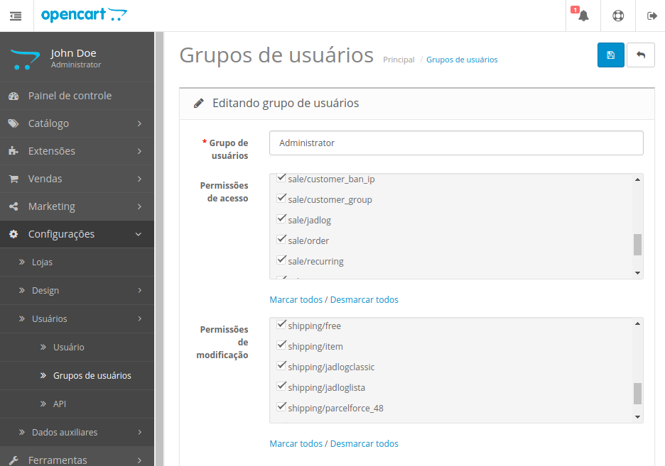

Nesta tela deve-se marcar as seguintes opções:

- Permissões de acesso:
  - sale/jadlog
  - shipping/jadlogclassic
  - shipping/jadloglista

- Permissões de modficação:
  - sale/jadlog
  - shipping/jadlogclassic
  - shipping/jadloglista

<sub>* *Você também pode utilizar o link **Marcar todos** abaixo dos respectivos quadros de permissões*.</sub>

Em seguida clique o botão *salvar*  para garantir acesso às páginas da extensão.

<a id="par%C3%A2metros-iniciais"></a>
### Parâmetros iniciais
Após liberar o acesso, será possível acessar as páginas de configuração da extensão. As modalidades de fretes disponíveis podem ser configuradas na tela *"Fretes"* acessível pelo menu *Extensões -> Fretes*:
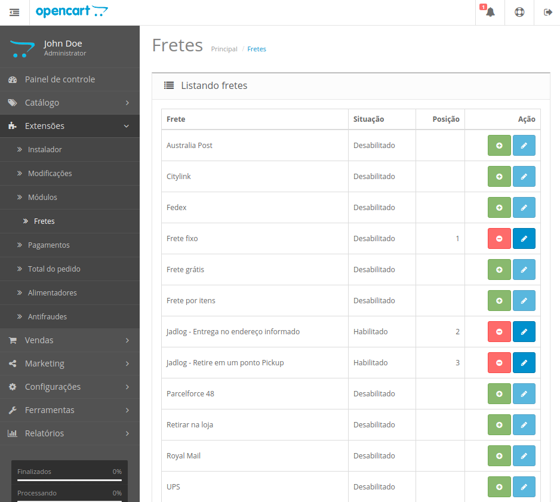

A extensão adiciona dois novos fretes:
- **Jadlog - Entrega no endereço informado**
- **Jadlog - Retire em um ponto Pickup**

Para editar os parâmetros de acesso ao serviço de frete e de pontos de retirada clique o botão *editar*  ao lado do frete denominado *"Jadlog - Retire em um ponto Pickup"* conforme indicado:
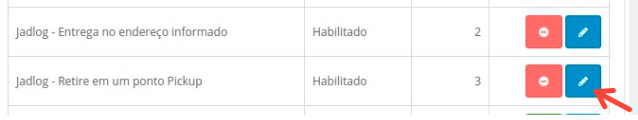

Ao acessar a página de configuração do frete *"Jadlog - Retire em um ponto Pickup"* será exibido um formulário com diversas informações que deverão ser preenchidas de acordo com os dados fornecidos pela Jadlog após a assinatura do contrato:
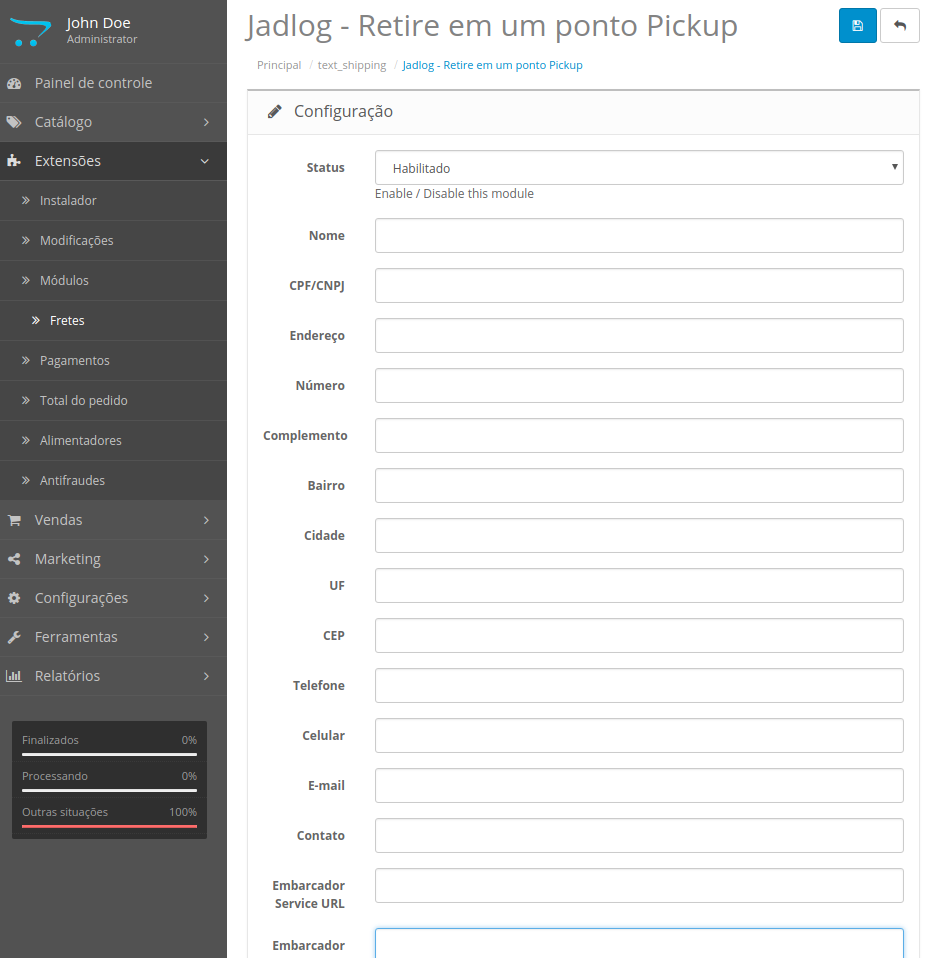

- **Status**:  
Deve ser habilitado para utilização desse frete.

- **Nome**:  
Nome da loja.

- **CPF/CNPJ**:  
Preencher com o CNPJ da loja (somente números sem pontuação).

- **Endereço**:  
Endereço da loja. Preencher com o tipo e nome do logradouro.

- **Número**:  
Número do endereço da loja.

- **Complemento**:  
Complemento do endereço da loja.

- **Bairro**:  
Bairro da loja.

- **Cidade**:  
Cidade da loja.

- **UF**:  
Estado da loja (informar a sigla com dois caracteres).

- **CEP**:  
CEP da loja (somente números).

- **Telefone**:  
Telefone da loja.

- **Celular**:  
Celular da loja.

- **E-mail**:  
Email do contato da loja.

- **Contato**:  
Nome do contato da loja.

- **Embarcador Service URL**:  
Endereço do serviço para inclusão de pedidos de coleta.  
Valor padrão: *http://www.jadlog.com.br/embarcador/api/pedido/incluir*

- **Embarcador Service Authorization**:  
Token de autorização fornecido pela Jadlog após a assinatura do contrato  
O token deve ser preenchido no formato *Bearer xYz1234.xYz1234.xYz1234*. É importante manter a palavra *Bearer* seguida por *espaço* e a sequência correta de caracteres.

- **Embarcador Service ClientID**:  
Identificação de cliente fornecida pela Jadlog após a assinatura do contrato.

- **Embarcador Conta Corrente**:  
Conta corrente fornecida pela Jadlog após a assinatura do contrato.

- **Embacador Número do Contrato**:  
Número de contrato fornecido pela Jadlog após a assinatura do contrato.

- **MyPudo Service URL**:  
Endereço para consulta dos pontos de retirada (pickup).  
Valor padrão: *http://mypudo.pickup-services.com/mypudo/mypudo.asmx/GetPudoList*

- **MyPudo FirmID**:  
Identificação da transportadora/embarcadora para o serviço de consulta de pontos de coleta.  
Valor padrão: *JAD*

- **MyPudo Key**:  
Chave do serviço de consulta de pontos de coleta fornecida pela Jadlog após a assinatura do contrato.

- **Tracking URL**:  
Endereço para rastreamento do pedido. Será exibido para o seu cliente na tela de resumo de pedido.  
Valor padrão: *http://www.jadlog.com.br/sitejadlog/tracking.jad?cte={TRACKING_ID}*

- **Frete Service URL**:  
Endereço para cotação do frete.  
Valor padrão: *http://www.jadlog.com.br/JadlogEdiWs/services/ValorFreteBean?method=valorar*

- **Frete User**:  
Usuário para acesso à cotação de frete. Preencher com o CNPJ da sua empresa, com zeros à esquerda e sem pontuação.* Ex: 09998887000135.

- **Frete Password**:  
Senha para acesso à cotação de frete fornecida pela Jadlog após a assinatura do contrato.

- **Sort Order**:  
Define a ordem de preferência de exibição deste frete na tela de escolha de frete pelo comprador.

Após preencher corretamente todas as informaçoes deve-se clicar o botão *salvar*  situado no canto superior direito da página.


*De forma análoga deve-se habilitar o frete **Jadlog - Entrega no endereço informado**. Nesse caso basta apenas informar o status como habilitado e preencher o campo **Sort Order***.


<a id="configurar-produtos"></a>
### Configurar produtos
Todos os produtos devem possuir seus respectivos pesos e dimensões corretamente cadastrados para que o cálculo do frete seja exato.

Esses atributos são informados na aba *Dados* do cadastro de produto:

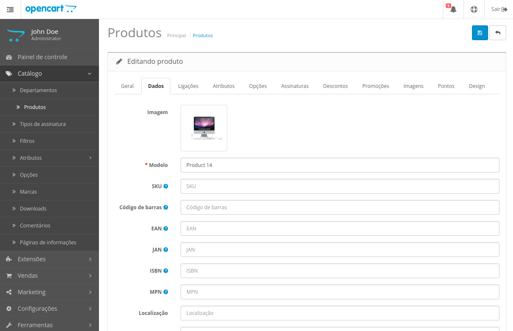

Abaixo seguem os campos que são utilizados no cálculo do frete:
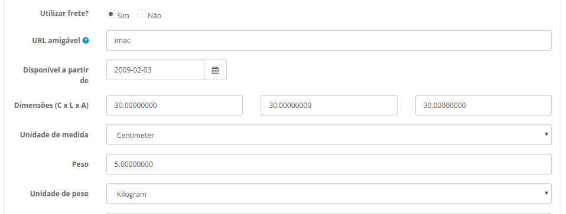
- **Dimensões (C x L x A)**:  
Devem ser preenchidas em centímetros.

- **Unidade de medida**:  
*Centimeter*.

- **Peso**:  
Preencher o peso em quilogramas.

- **Unidade de peso**:  
*Kilogram*.


<a id="utiliza%C3%A7%C3%A3o-pelos-clientes"></a>
## Utilização pelos clientes
Após configurada a extensão os clientes poderão escolher duas novas formas de frete **Jadlog Pickup**:  
- **Jadlog - Entrega no endereço informado**
- **Jadlog - Retire em um ponto Pickup**
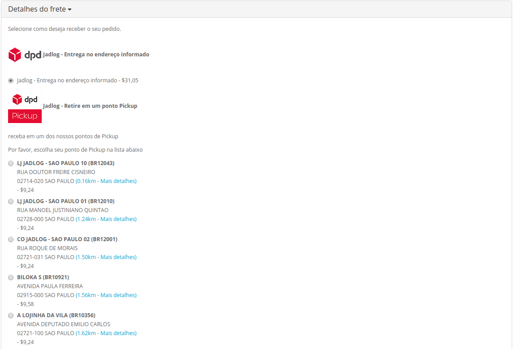

Caso a modalidade *"Jadlog - Retire em um ponto Pickup"* esteja habilitada ele pode escolher onde deseja retirar as mercadorias indicando um ponto "pickup" logo abaixo da mensagem *"Por favor, escolha seu ponto de Pickup na lista abaixo"*. Os pontos exibidos são próximos ao endereço de cadastro do cliente.
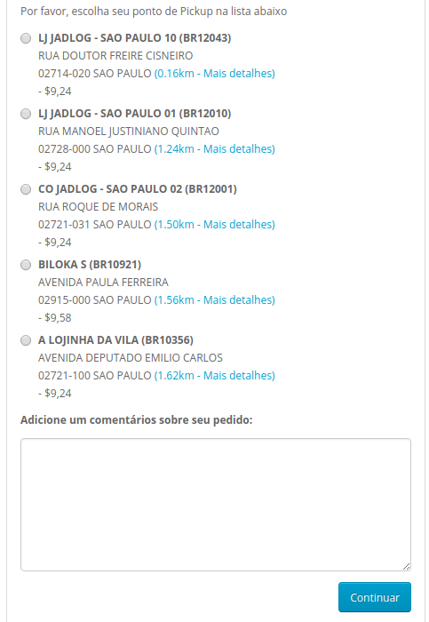

O cliente deve escolher o ponto desejado e clicar em continuar.

Caso o cliente deseje pode confirmar a localização e o horário de atendimento do ponto escolhido ao clicar em *Mais detalhes*:
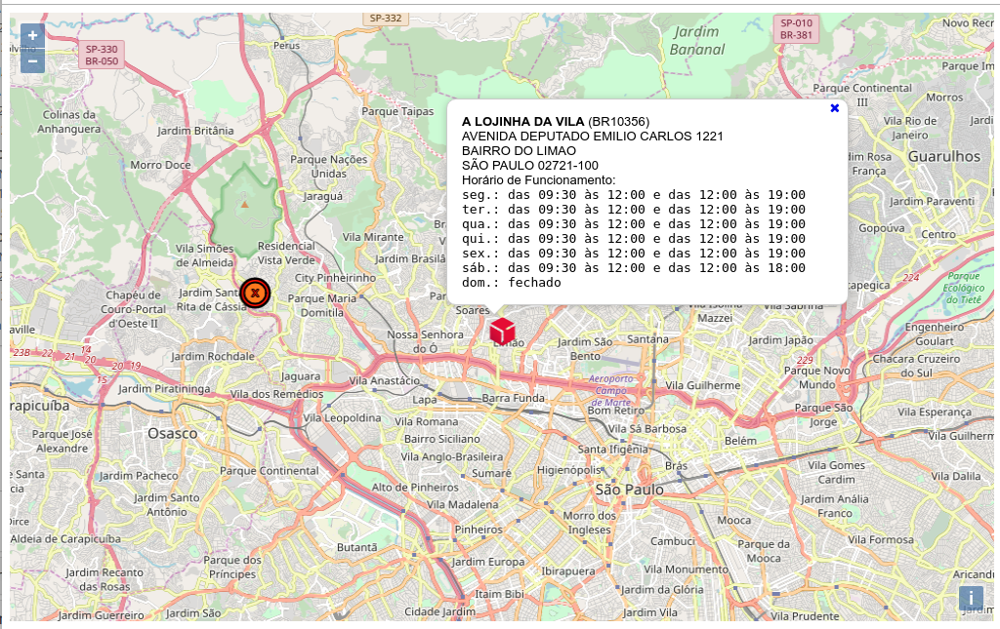

<a id="utiliza%C3%A7%C3%A3o-pelo-administrador-da-loja"></a>
## Utilização pelo administrador da loja
Os pedidos feitos pelos compradores que escolheram frete com uma das modalidades *Jadlog* irão aparecer na tela *Gerenciamento de pedidos* acessível pelo menu *Vendas -> Jadlog*.
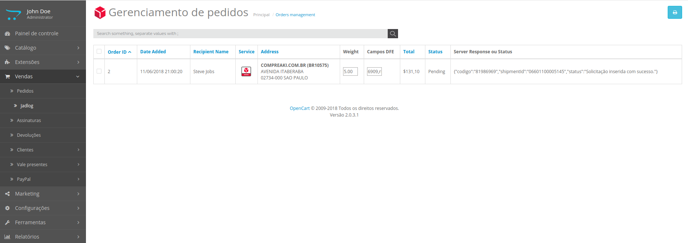

Para efetivar o pedido de coleta é necessário preencher os dados fiscais do pedido e depois enviar a solicitação de coleta.

<a id="preencher-dados-fiscais"></a>
### Preencher dados fiscais
Os dados fiscais do pedido são informados no campo *"Campos DFE"*. Por padrão o sistema já traz um modelo do que deve ser preenchido.

```
cfop,danfeCte,nrDoc,serie,tpDocumento,valor|cfop,danfeCte,nrDoc,serie,tpDocumento,valor
```

Cada documento fiscal do pedido é representado por uma sequência *cfop,danfeCte,nrDoc,serie,tpDocumento,valor*. Caso seja necessário enviar mais de um documento fiscal por pedido, separar cada conjunto de dados referente a um documento fiscal pelo caracter *"|"*.

Detalhes do documento fiscal:
- cfop  
Código Fiscal de Operações e Prestações (CFOP)

- danfeCte  
Número do DANFE (Documento Auxiliar da Nota Fiscal Eletrônica). Caso não exista preencher com *null*.

- nrDoc  
Número do documento fiscal. Caso não exista preencher como *DECLARACAO*.

- serie  
Série do documento fiscal. Caso não exista preencher com *null*.

- tpDocumento  
Preencher de acordo com o tipo de documento fiscal:  
  - 0 para Declaração
  - 1 para Nota Fiscal
  - 2 para Nota Fiscal Eletrônica
  - 3 para Conhecimento de Transporte Rodoviário de Cargas
  - 4 para Conhecimento de Transporte Eletrônico 
  - 99 para OUTROS

- valor  
Valor referente a esse documento fiscal

Cada um desses valores deve ser preenchidos separados por vírgula (*","*).

O exemplo abaixo mostra o envio de um pedido com duas declarações, uma no valor de R$20,20 e outra no valor de R$80,00:

```
6909,null,DECLARACAO,null,0,20.2|6909,null,DECLARACAO,null,0,80.0
```

<a id="enviar-solicita%C3%A7%C3%A3o-de-coleta"></a>
### Enviar solicitação de coleta
Após preencher os dados fiscais, deve-se enviar a solicitação de coleta para a Jadlog. Para isso, na mesma tela de gerencimamento de pedidos deve-se marcar os pedidos que serão enviados à Jadlog, em seguida clicar o botão *Exportar para Jadlog*  (localizado no canto superior direito):
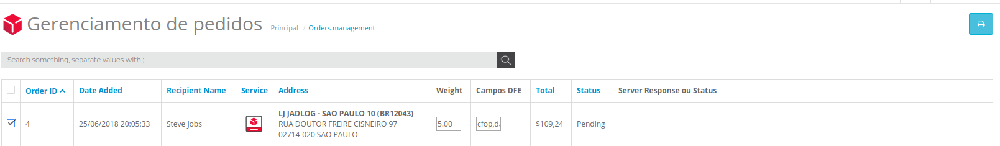

O sistema irá retornar com os dados gerados pelo pedido de coleta na Jadlog. Deve-se notar que serão geradas as seguintes informações no campo *"Server Response ou Status"*:
- codigo
- shipmentId
- status

O status "Solicitação inserida com sucesso" indica que a Jadlog recebeu corretamente o pedido de coleta e irá dar prosseguimento ao processo de coleta e posterior entrega do pedido.

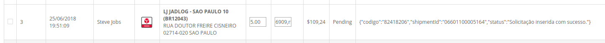

Não há problema de enviar o mesmo pedido múltiplas vezes. O sistema está preparado para reconhecer pedidos duplicados utilizando o "número do pedido" (*Order ID*).

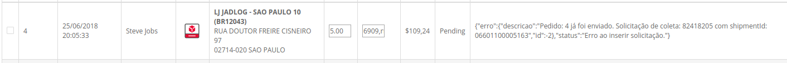

Caso ocorra esse erro para um pedido novo ou outras situações não descritas neste manual entre em contato com a Jadlog.

<a id="desenvolvimento"></a>
## Desenvolvimento

* [Jadlog](http://www.jadlog.com.br) - *Uma empresa DPDgroup*

